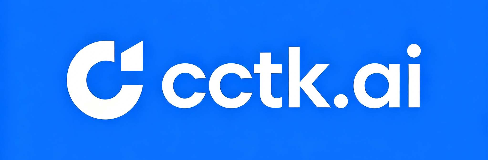
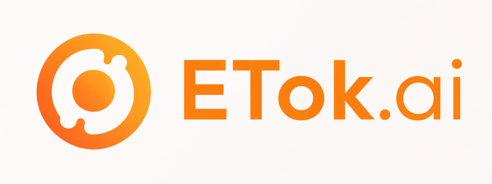
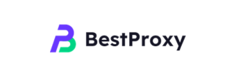
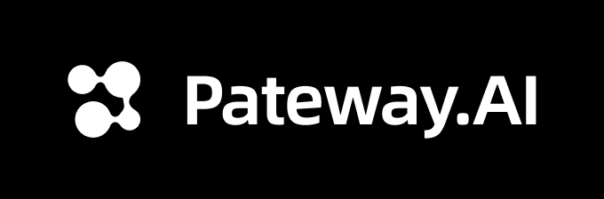
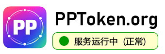
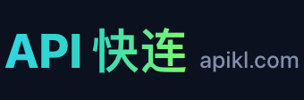
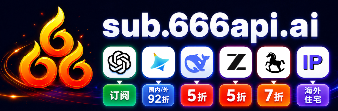
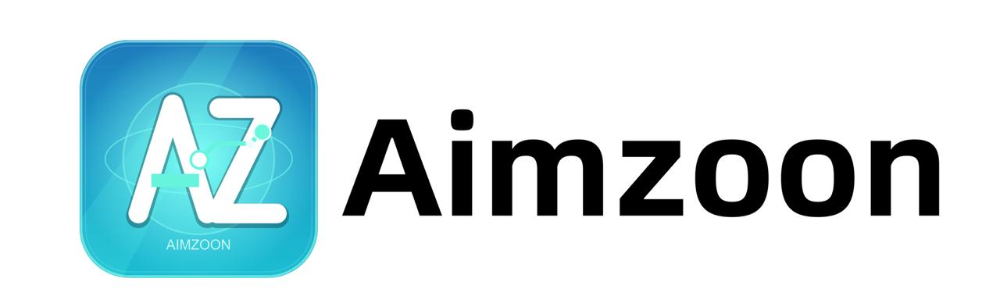

# Sub2API

<div align="center">

[](https://golang.org/)
[](https://vuejs.org/)
[](https://www.postgresql.org/)
[](https://redis.io/)
[](https://www.docker.com/)

<a href="https://trendshift.io/repositories/21823" target="_blank"></a>

**AI API 网关平台 - 订阅配额分发管理**

[English](README.md) | 中文 | [日本語](README_JA.md)

</div>


## ⚠️ 重要提醒

使用本项目前，请务必仔细阅读以下内容：

- **🚨 服务条款风险**：使用本项目可能违反 Anthropic 等上游服务商的服务条款。请在使用前仔细阅读相关服务商的用户协议，由此产生的一切风险由用户自行承担。
- **⚖️ 合规使用**：请在符合您所在国家或地区法律法规的前提下使用本项目，严禁将其用于任何违法违规用途。
- **📖 免责声明**：本项目仅供技术学习与研究使用，作者不对因使用本项目导致的账户封禁、服务中断、数据丢失或其他任何直接或间接损失承担责任。
- **🚫 无商业授权**：本项目从未授权任何个人或组织基于本项目开展任何形式的商业化运营。任何以本项目名义或基于本项目从事的商业行为均与本项目及其开发者无关，由此产生的一切纠纷、损失和法律责任由行为主体自行承担。

## ❤️ 赞助商

> [想出现在这里？](mailto:support@sub2api.org)

<table>

<tr>
<td width="180"><a href="https://cctk.ai/register?aff=SUB2API"></a></td>
<td>感谢 CCTK.AI 赞助了本项目！<a href="https://cctk.ai/register?aff=SUB2API">CCTK.AI</a> 是一个专注于稳定与性价比的 AI API 网关平台，提供 Claude、OpenAI、Gemini 等主流模型的高速中转服务，无缝兼容 Claude Code、Codex 等主流编程工具，以远低于官方的成本获得同等的模型能力。点击<a href="https://cctk.ai/register?aff=SUB2API">此链接</a>注册，即刻体验更快、更稳、更省的 AI API 接入。</td>
</tr>

<tr>
<td width="180"><a href="https://www.openmodel.ai?ref=sub2api"></a></td>
<td>一个API，顶级模型随便用！<a href="https://www.openmodel.ai?ref=sub2api">OpenModel</a> 专注于生产级、高可用的 AI API 网关，让你的应用真正做到高速稳定：自动故障转移、智能选最优渠道、生产级 SLA 保障。远超单一供应商的 SLA，让稳定性成为您的核心竞争力。</td>
</tr>

<tr>
<td width="180"><a href="https://etok.ai"></a></td>
<td>感谢 ETok.ai 赞助了本项目！ETok.ai 致力于打造一站式 AI 编程工具服务平台。我们提供 Claude Code 专业套餐及技术社群服务，同时支持 Google Gemini 和 OpenAI Codex。通过精心设计的套餐方案和专业的技术社群，为开发者提供稳定的服务保障和持续的技术支持，让 AI 辅助编程真正成为开发者的生产力工具。点击<a href="https://etok.ai">这里</a>注册！</td>
</tr>

<tr>
<td width="180"><a href="https://apikey.fun/register?aff=SUB2API"></a></td>
<td>感谢 APIKEY.FUN 赞助了本项目！<a href="https://apikey.fun/register?aff=SUB2API">APIKEY.FUN</a> 是 sub2api 开源项目的核心贡献者之一，致力于提供开放、稳定、高性价比的 AI API 接入服务。平台支持 Claude、OpenAI、Gemini 等热门模型的 API 中转服务，价格低至官方原价的 7%。通过专属链接 <a href="https://apikey.fun/register?aff=SUB2API">APIKEY</a> 注册，可享受所有充值永久 95 折优惠。</td>
</tr>

<tr>
<td width="180"><a href="https://aigocode.com/invite/SUB2API"></a></td>
<td>感谢 AIGoCode 赞助了本项目！AIGoCode 是一站式集成 Claude Code、Codex 以及最新 Gemini 模型的综合平台，为您提供稳定、高效、高性价比的 AI 编程服务。平台提供灵活的订阅方案，零封号风险，免 VPN 直连，响应极速。AIGoCode 为 sub2api 用户准备了专属福利：通过<a href="https://aigocode.com/invite/SUB2API">此链接</a>注册，首次充值可额外获得 10% 赠送额度！</td>
</tr>

<tr>
<td width="180"><a href="https://www.aicodemirror.com/register?invitecode=KMVZQM"></a></td>
<td>感谢 AICodeMirror 赞助了本项目！AICodeMirror 提供 Claude Code / Codex / Gemini CLI 官方高稳定性中转服务，企业级并发、快速开票、7×24 小时专属技术支持。Claude Code / Codex / Gemini 官方通道低至原价 38% / 2% / 9%，充值更享额外折扣！AICodeMirror 为 sub2api 用户提供专属福利：通过<a href="https://www.aicodemirror.com/register?invitecode=KMVZQM">此链接</a>注册，首次充值立享 8 折优惠，企业客户最高可享 75 折！</td>
</tr>

<tr>
<td width="180"><a href="https://shop.bmoplus.com/?utm_source=github"></a></td>
<td>感谢 BmoPlus 赞助了本项目！BmoPlus 是一家专为AI订阅重度用户打造的可靠 AI 账号代充服务商，提供稳定的 ChatGPT Plus / ChatGPT Pro(全程质保) / Claude Pro / Super Grok / Gemini Pro 的官方代充&成品账号。 通过<a href="https://shop.bmoplus.com/?utm_source=github">BmoPlus AI成品号专卖/代充</a>注册下单的用户，可享GPT 官网订阅一折 的震撼价格！</td>
</tr>

<tr>
<td width="180"><a href="https://bestproxy.com/?keyword=a2e8iuol"></a></td>
<td>感谢 Bestproxy 赞助了本项目！<a href="https://bestproxy.com/?keyword=a2e8iuol">Bestproxy</a> 是一家提供高纯度住宅IP，支持一号一IP独享，结合真实家庭网络与指纹隔离，可实现链路环境隔离，降低关联风控概率。</td>
</tr>

<tr>
<td width="180"><a href="https://pateway.ai/?ch=1tsfr51"></a></td>
<td>感谢 PatewayAI 赞助了本项目！PatewayAI 是一家面向重度 AI 开发者、专注官方直连的高品质模型 API 中转服务商。提供 Claude 全系列与 Codex 系列模型，100% 官方源直供，不掺假不注水，欢迎检验。计费透明，Token 级账单可逐笔核验。
同时支持企业级高并发，并为企业客户提供了专业的管理平台，企业客户可签订正式合同并开具发票，更多详情进入官网获取联系方式。
现在通过 <a href="https://pateway.ai/?ch=1tsfr51">此链接</a> 注册即送 $3 试用额度，用户充值低至 6 折，邀请好友双向赠送，邀请奖励可达 $150。</td>
</tr>

<tr>
<td width="180"><a href="https://api.pptoken.org/register?promo=SUB2API"></a></td>
<td>感谢 PPToken.org 赞助本项目！ <a href="https://api.pptoken.org/register?promo=SUB2API">PPToken.org</a> 主打 GPT 系列模型 API 中转服务，支持 Codex、Claude Code、OpenAI 兼容客户端及 Gemini CLI 等工具接入。充值 1:1，1 元=1 美元额度；GPT 模型最低 0.16 倍倍率，综合成本约为官方价格的 0.22 折，最快首字 Token 约 1 秒，适合开发者低成本、高响应速度接入 GPT 模型能力。技术支持： 7×24 小时真人响应（不是机器人），群内@技术，10 分钟内有回复 。赞助商福利：前 200 名用户通过 <a href="https://api.pptoken.org/register?promo=SUB2API">[专属注册链接]</a> 注册，输入优惠码 `SUB2API`，可领取 Codex / Claude Code 免费试用额度，无门槛、不绑卡。
</td>
</tr>

<tr>
<td width="180"><a href="https://unity2.ai/register?source=sub2api"></a></td>
<td>感谢 Unity2 赞助本项目！ <a href="https://unity2.ai/register?source=sub2api">Unity2</a> 是面向个人开发者、团队、企业的高性能 AI 模型 API 中转平台，长期服务国内头部企业，日均承载超 300 亿 token 调用，支持 5000 RPM 级高并发。一个 API Key 即可适配 Claude Code、Codex、OpenAI 模型、IDE 插件和 Agent 工作流等场景。具备企业级稳定供应能力，在高并发、持续调用和团队集中采购场景下依然保持低延迟、高可用。同时支持余额计费、组合订阅、首充优惠、企业开票、专属 1v1 对接，适合个人高频使用和企业长期接入。现在注册 Unity2.ai 可领取 $2 余额，加入官方群再送 $10 余额，合计最高可领 $12 免费额度，适合先体验后长期使用。<a href="https://unity2.ai/register?source=sub2api">注册链接</a>
</td>
</tr>

<tr>
<td width="180"><a href="https://veilx.io/#/hello/SJRBRVDV"></a></td>
<td>感谢 Veilx 赞助本项目！ <a href="https://veilx.io/#/hello/SJRBRVDV">Veilx</a> CDN 专为超大规模 API 请求场景打造，针对 AI 中转站业务与 AI API 调用链路进行了深度优化，轻松应对高并发、高频请求与大流量传输，为开发者与企业提供更快、更稳、更低延迟的加速体验。无论是 OpenAI、Claude、Gemini 等 AI 接口中转，还是聊天、绘图、Embedding、流式输出等复杂场景，Veilx 都能显著提升响应速度与连接稳定性，有效降低网络波动带来的超时与失败问题。同时，Veilx 提供中国三网优化回国极速线路，大幅提升中国大陆地区访问海外 AI 服务的速度与稳定性，特别适合全球 AI 中转平台、海外 AI SaaS、跨境业务与高并发 API 系统部署。专为 AI API 而生，让你的 AI 中转服务更快、更稳、更省心。<a href="https://veilx.io/#/hello/SJRBRVDV">购买地址</a>
</td>
</tr>

<tr>
<td width="180"><a href="https://roxybrowser.com/invite/bgGKG7"></a></td>
<td>感谢 RoxyBrowser 赞助本项目！<a href="https://roxybrowser.com/invite/bgGKG7">RoxyBrowser</a> 是 Sub2API 的理想搭档：内置原生 Roxy AI Agent 与高质量原生住宅 IP，支持通过简单命令实现批量自动化，显著提升多账号管理的安全性与效率！点击<a href="https://roxybrowser.com/invite/bgGKG7">此链接</a>注册，可领取免费住宅 IP 套餐与终身 9 折优惠。
</td>
</tr>

<tr>
<td width="180"><a href="https://apikl.ai"></a></td>
<td>感谢 Apikl 赞助本项目！平台基于 Sub2API 搭建，为开发者提供 Codex / Claude 系列模型的中转服务，专注于长期稳定、高速直连与高性价比。支持按量计费的余额结算、企业级正规发票及一对一专属对接。<a href="https://apikl.ai">立即注册</a>即享充值 1:1 赠送 — 余额翻倍！
</td>
</tr>

<tr>
<td width="180"><a href="https://tokeneum.ai"></a></td>
<td>感谢 TokenEum 赞助本项目！<a href="https://tokeneum.ai">TokenEum</a> 是一家综合性 AI 模型聚合平台与智能体开发公司，汇聚 Claude、Gemini、OpenAI 等国际顶级模型，以及 GLM、Qwen、Kimi 等主流开源模型，提供不同质量与价格梯度的丰富选择，满足多样化需求。平台还接入了 Seedance2.0、Happy Horse 等前沿视频生成模型。秉持透明诚信的经营理念，TokenEum 确保所有模型信息真实可靠。访问 <a href="https://tokeneum.ai">tokeneum.ai</a> 开始使用。
</td>
</tr>

<tr>
<td width="180"><a href="https://666api.work/sub2api"></a></td>
<td>感谢 666api 赞助本项目！<a href="https://666api.work/sub2api">666api</a> 是一站式综合服务平台，提供：<br>
⚡ API 中转 — 全球模型按量计费接入，100% 官方源直供，最高 75 折优惠<br>
&nbsp;&nbsp;&nbsp;&nbsp;独家特惠：智谱 GLM 5 折 · DeepSeek V4-pro 5 折 · Seedance 2.0 0.8 折（白名单）· HappyHorse 海外版 3 折（白名单）<br>
🔑 GPT 订阅账号（含同源 IP）· 全球住宅 IP<br>
💰 支持开票
</td>
</tr>

<tr>
<td width="180"><a href="https://dis.chatdesks.cn/chatdesk/hsyqsub2api.html"></a></td>
<td>感谢火山方舟 Agent Plan 模型赞助了本项目！方舟 Agent Plan 模型订阅套餐集成了包含 Doubao-Seed、Doubao-Seedance、Doubao-Seedream 等在内的字节跳动自研 SOTA 级模型，覆盖文本、代码、图像、视频等多模态任务。最新支持 MiniMax-M3、DeepSeek-V4 系列、GLM-5.1、Doubao-Seed-2.0 系列、Kimi-K2.6 等模型，工具不限。超全模态模型与 Harness 升级一步到位，深度支持 Agent 框架与 AI 编程工具。一次订阅，可以为不同任务切换合适的 AI 引擎。方舟 Coding Plan 为 Sub2Api 的用户提供了专属福利：通过<a href="https://dis.chatdesks.cn/chatdesk/hsyqsub2api.html">此链接</a>订阅方舟 Coding Plan，新客户首两个月享 2.5 折优惠 <a href="https://dis.chatdesks.cn/chatdesk/hsyqsub2api.html">>>For developers outside Mainland China, please click here</a></td>
</tr>

<tr>
<td width="180"><a href="https://sui-xiang.com/"></a></td>
<td>感谢 随想AI网关 赞助本项目！<a href="https://sui-xiang.com/">随想AI网关</a>  是一家可靠高效的 API 中继服务提供商，提供 Claude、Codex、Gemini 等的中继服务。注重隐私的中转站·无数据倒卖·无模型掺水，隐私，透明，极速售后。新账户注册每日签到就送 0.5 元测试额度，充值额度 1:1，无需订阅，按量付费。多线路冗余、跨区域容灾、自动故障切换,长链路 SSE 不中断。99.9% 可用性,关键调用从不掉队。
</td>
</tr>

<tr>
<td width="180"><a href="https://www.miyaip.com/?invitecode=sub2api"></a></td>
<td>感谢 MiyaIP 赞助本项目！<a href="https://www.miyaip.com/?invitecode=sub2api">MiyaIP</a> 是一家专注于全球住宅代理网络服务的平台，致力于为企业开发者、跨境业务团队及AI 应用用户提供高质量、纯净的海外住宅 IP 资源。为 AI 平台、海外 SaaS 及其他在线服务提供稳定、独立的海外网络环境，支持多地区访问测试和项目环境隔离。适用于需要访问海外 AI 服务的开发和测试场景，例如：AI 模型平台访问、AI 开发测试、AI SaaS 服务使用、AI API 调试、多地区网络环境验证
</td>
</tr>

<tr>
<td width="180"><a href="https://anpin.ai"></a></td>
<td>感谢 <a href="https://anpin.ai">anpin.ai</a> 赞助本项目！anpin.ai 是一家致力于推动 AI 普惠的高端 AI 中转服务平台。我们以先进的技术架构和全球分布式部署，为用户提供直达国际顶尖大模型的高速通道。<br>
自建一手号池：1-3S超快响应 支持同行分发<br>
极致稳定：多线智能路由 + 冗余备份系统，确保服务全年无休、高可用运行；<br>
模型真实性：不做任何内容干预与二次过滤，让您体验到最纯粹、最强大的原生模型能力。<br>
充值1：1 企业级服务可开票，安品Ai不只是中转站，更是您连接前沿智能世界的安全、可靠、高效桥梁
</td>
</tr>

<tr>
<td width="180"><a href="https://www.proxy4free.com/?keyword=4yjqecpc"></a></td>
<td>感谢 Proxy4Free 赞助本项目！Proxy4Free 是面向开发者和 AI 应用的数据代理服务商，提供住宅代理、静态住宅代理、ISP 代理及数据中心代理等多种代理解决方案，适用于 Web Scraping、Browser Automation、AI Agent 等场景。支持全球 IP 资源、稳定连接与灵活切换，帮助开发者提升数据采集成功率，降低 IP 封禁风险。通过<a href="https://www.proxy4free.com/?keyword=4yjqecpc">此链接注册</a>即可开始体验，轻松构建更稳定、高效的自动化工作流。
</td>
</tr>

<tr>
<td width="180"><a href="http://www.fastaitoken.com/register"></a></td>
<td>🎉 感谢 FastAIToken 对本项目的赞助！ <a href="http://www.fastaitoken.com/register">FastAIToken</a> 是面向开发者的 AI API 聚合平台，支持 OpenAI、Claude、Gemini 等主流大模型，充值 1:1，1 元 = 1 美元 API 额度，让开发者以更低成本、更便捷地使用全球领先的大模型服务。<br>

🚀 平台提供多种渠道自由选择：超级低价的0.02x OpenAI 福利分组（限时）、低至 0.25x OpenAI 分组、0.7x Claude 95%固定缓存、1.2x Claude Max 渠道；同时提供公开状态页，实时展示各分组的可用率、延迟及运行状态，服务透明可靠，并提供 7×24 小时真人技术支持（非机器人），快速响应开发者需求。
</td>
</tr>

<tr>
<td width="180"><a href="http://aimzoon.com"></a></td>
<td>感谢 Aimzoon 对本项目的赞助！ <a href="http://aimzoon.com">Aimzoon</a> 提供稳定、高性价比的 AI API 接入服务，支持开发者将常用 AI 服务快速接入 Codex、Claude Code、Gemini CLI 等编程工具。无需复杂配置，更快接入，更稳调用，更省成本。codex倍率优惠，特价倍率等促销不断，注册即送免费体验额度，让 AI 编程真正进入日常工作流。<a href="http://aimzoon.com">点击这里</a>注册体验！
</td>
</tr>

</table>

## 项目概述

Sub2API 是一个 AI API 网关平台，用于分发和管理 AI 产品订阅的 API 配额。用户通过平台生成的 API Key 调用上游 AI 服务，平台负责鉴权、计费、负载均衡和请求转发。

## 核心功能

- **多账号管理** - 支持多种上游账号类型（OAuth、API Key）
- **API Key 分发** - 为用户生成和管理 API Key
- **精确计费** - Token 级别的用量追踪和成本计算
- **智能调度** - 智能账号选择，支持粘性会话
- **并发控制** - 用户级和账号级并发限制
- **速率限制** - 可配置的请求和 Token 速率限制
- **内置支付系统** - 支持 EasyPay 易支付、支付宝官方、微信官方、Stripe，用户自助充值，无需独立部署支付服务（[配置指南](docs/PAYMENT_CN.md)）
- **管理后台** - Web 界面进行监控和管理
- **外部系统集成** - 支持通过 iframe 嵌入外部系统（如工单等），扩展管理后台功能

## 生态项目

围绕 Sub2API 的社区扩展与集成项目：

| 项目 | 说明 | 功能 |
|------|------|------|
| ~~[Sub2ApiPay](https://github.com/touwaeriol/sub2apipay)~~ | ~~自助支付系统~~ | **已内置** — 支付功能已集成到 Sub2API 中，无需独立部署。详见 [支付配置指南](docs/PAYMENT_CN.md) |
| [sub2api-mobile](https://github.com/ckken/sub2api-mobile) | 移动端管理控制台 | 跨平台应用（iOS/Android/Web），支持用户管理、账号管理、监控看板、多后端切换；基于 Expo + React Native 构建 |

## 技术栈

| 组件 | 技术 |
|------|------|
| 后端 | Go 1.25.7, Gin, Ent |
| 前端 | Vue 3.4+, Vite 5+, TailwindCSS |
| 数据库 | PostgreSQL 15+ |
| 缓存/队列 | Redis 7+ |

---

## Nginx 反向代理注意事项

通过 Nginx 反向代理 Sub2API（或 CRS 服务）并搭配 Codex CLI 使用时，需要在 Nginx 配置的 `http` 块中添加：

```nginx
underscores_in_headers on;
```

Nginx 默认会丢弃名称中含下划线的请求头（如 `session_id`），这会导致多账号环境下的粘性会话功能失效。

---

## 部署

> **本仓库是 fork：`gthubtom1/sub2api-standby`。**  
> 完整步骤见：**[docs/DEPLOY_STANDY_CN.md](docs/DEPLOY_STANDY_CN.md)**  
> 下面只保留本 fork 命令；**不含官方安装入口。**

### 警告（必读）

- **禁止**管理后台「检查更新 / 更新」——会下载官方二进制，冲掉预备健康等改动  
- **禁止**官方镜像 `weishaw/sub2api`、官方仓库 `Wei-Shaw/sub2api` 的任何安装命令  
- 升级只用：本仓 `git pull` + `Dockerfile.custom` 构建 + 替换容器  

### 推荐：Docker 源码构建

```bash
git clone https://github.com/gthubtom1/sub2api-standby.git
cd sub2api-standby

# 低配机先加 2G swap，再构建
export DOCKER_BUILDKIT=1
docker build --memory=2g --build-arg VERSION=0.1.157-standby \
  -f Dockerfile.custom -t sub2api-custom:0.1.157-standby .

cd deploy
cp .env.example .env && chmod 600 .env
# 编辑 POSTGRES_PASSWORD / JWT_SECRET / TOTP_ENCRYPTION_KEY 等
mkdir -p data postgres_data redis_data
docker compose -f docker-compose.local.yml up -d
```

### 已有数据：只换程序

```bash
# 保留 data / postgres / redis 目录
# 详见 docs/DEPLOY_STANDY_CN.md 「3B」
```

### 本 fork 一键准备 compose 文件

```bash
mkdir -p sub2api-deploy && cd sub2api-deploy
curl -sSL https://raw.githubusercontent.com/gthubtom1/sub2api-standby/main/deploy/docker-deploy.sh | bash
# 需本机已有镜像 sub2api-custom:0.1.157-standby
docker compose -f docker-compose.local.yml up -d
```

### 升级

```bash
git pull
docker build --memory=2g --build-arg VERSION=0.1.157-standby \
  -f Dockerfile.custom -t sub2api-custom:0.1.157-standby .
docker compose -f deploy/docker-compose.local.yml up -d
```

### 误点网页更新

不要删数据库。用本 fork 镜像按 [DEPLOY_STANDY_CN.md](docs/DEPLOY_STANDY_CN.md) 的「误点更新」一节重建容器即可。

---

## 项目结构

```
sub2api/
├── backend/                  # Go 后端服务
│   ├── cmd/server/           # 应用入口
│   ├── internal/             # 内部模块
│   │   ├── config/           # 配置管理
│   │   ├── model/            # 数据模型
│   │   ├── service/          # 业务逻辑
│   │   ├── handler/          # HTTP 处理器
│   │   └── gateway/          # API 网关核心
│   └── resources/            # 静态资源
│
├── frontend/                 # Vue 3 前端
│   └── src/
│       ├── api/              # API 调用
│       ├── stores/           # 状态管理
│       ├── views/            # 页面组件
│       └── components/       # 通用组件
│
└── deploy/                   # 部署文件
    ├── docker-compose.yml    # Docker Compose 配置
    ├── .env.example          # Docker Compose 环境变量
    ├── config.example.yaml   # 二进制部署完整配置文件
    └── install.sh            # 一键安装脚本
```

## Star History

<a href="https://star-history.com/#gthubtom1/sub2api-standby&Date">
 <picture>
   <source media="(prefers-color-scheme: dark)" srcset="https://api.star-history.com/svg?repos=gthubtom1/sub2api-standby&type=Date&theme=dark" />
   <source media="(prefers-color-scheme: light)" srcset="https://api.star-history.com/svg?repos=gthubtom1/sub2api-standby&type=Date" />
   
 </picture>
</a>

---

## 许可证

本项目基于 [GNU 宽通用公共许可证 v3.0](LICENSE)（或更高版本）授权。

Copyright (c) 2026 Wesley Liddick

---

<div align="center">

**如果觉得有用，请给个 Star 支持一下！**

</div>
